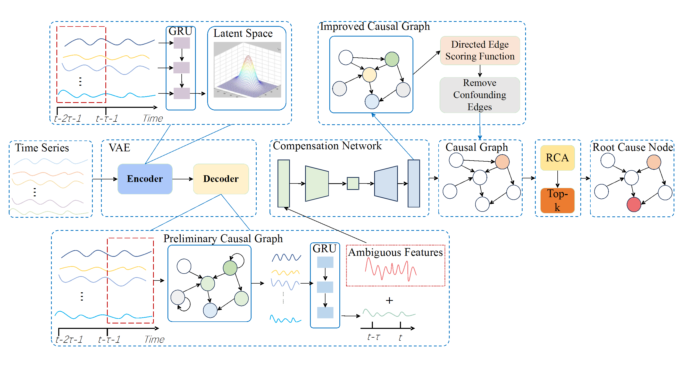

# CARAF:

该论文目前在投，所以先公开一个demon，使用了数据集中的一小部分，

## Description

`CARAF`  是一个针对微服务系统`KPI`的故障检测算法，因为投稿中，不详细论述

## Quick Start

### Requirements 

```
- Python3.6  
- pytorch1.10.2 cuda 11.3
- 其余见requirements.txt
- python demon.py 即可直接执行
```

## Dataset 
使用公开数据集，github中提供了其中的一部分预处理后的数据集，源数据集暂且不公开

[fse-ss](./fse-ss/)  是Sock-shop微服务系统的故障数据集，里面为Carts服务器cpu发生故障时的时序数据


## Project Structure
```
.
├── README.md
├── CRVAE  因果循环VAE，诊断上游部分
│   ├── models
│   │   ├── cgru_error.py #模型和损失函数
│   │   ├── torchlinear.py #有向边评分函数
│   │   └── _init_.py
│   ├── metrics
│   │   ├── visualization_metrics.py #时序预测可视化
│   │   └── _init_.py
│   └── CRVAE_demo.py
├── fse_ss 提供的部分数据集
│   └──  carts_cpu
├── PageRank  诊断下游部分
│   ├── data_provider
│   │   ├── data_factory.py #模型和损失函数
│   │   ├── data_loader.py #有向边评分函数
│   │   └── _init_.py
│   ├── models
│   │   ├── utils.py #时序预测可视化
│   │   └── _init_.py
│   └── algo.py
├── demon.py: running demon
└── requirements.txt

```

